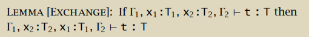
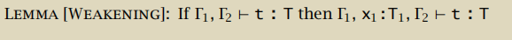
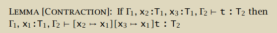
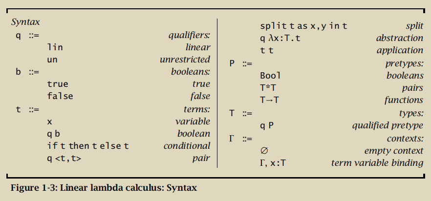
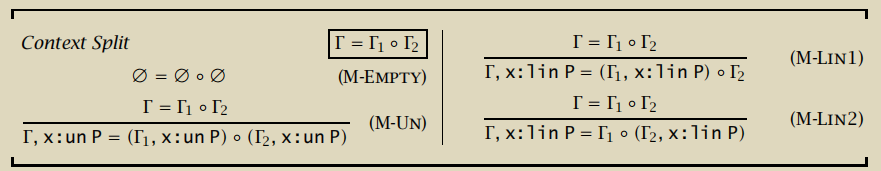
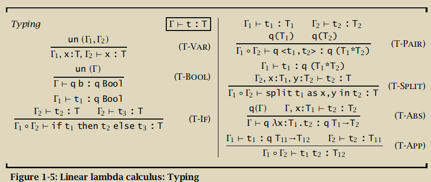
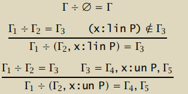
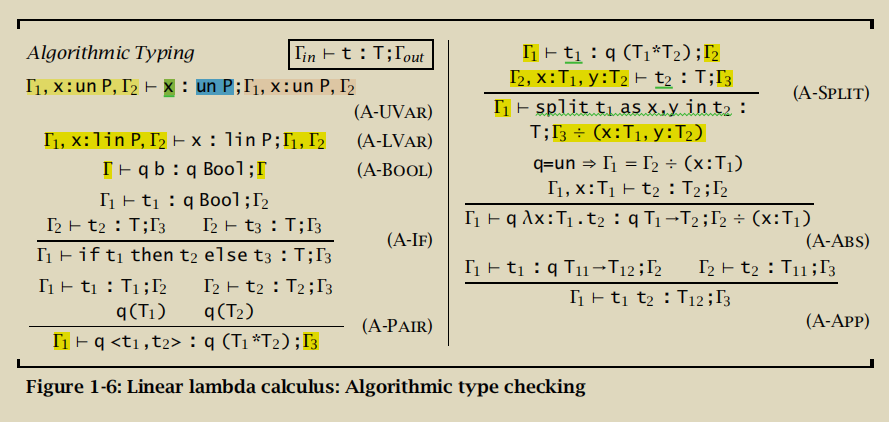

“次结构类型系统”会在常见类型系统的基础上，取消下列性质的一个或者多个：

Exchange: 

Weakening: 

Contraction: 

| 规则        | 变量使用次数         | 允许的操作      |
|-------------|----------------------|-----------------|
| Linear      | = 1                  | E               |
| Affine      | ≤ 1                  | E, W            |
| Relevant    | ≥ 1                  | E, C            |
| Ordered     | = 1，且按引入的顺序  | 无              |

Syntax: 

以下是Context Split的定义，翻译成人话：

0. 空context在split后产生2个空context
1. un变量在split时会复制到左右两边。
2. lin变量在split时要不划给左边，要不划给右边。

具体怎么split，没说！(见下文)

下面是Typing规则保证的2个不变式：

1. lin变量在任何路径使用次数=1
2. un项不包含lin项

以下是Typing 规则，注意Context split并未给出具体算法，只是说明存在Γ1，Γ2， Γ1 o Γ2 = Γ ，使得 Typing 成立。

在Typing 的过程中，始终坚持保证**一个lin变量只能使用1次**。例如在T-APP中，
t1 得到了 上下文 Γ1，t2 得到了 上下文 Γ2。根据context split的定义，Γ1和Γ2中的lin变量不重叠，所以不会存在t1使用t2中lin 变量的现象。

此外还要确保**没有lin变量没有用到**，例如T-VAR中，检查了x:T以外的context不包含lin变量。T-BOOL也是。

下面介绍如何执行context split：

首先：定义 “context difference”,用除号表示

规则1：Γ2=空则结果Γ3等于被除数Γ1

规则2：对于Γ2中的所有 `x:lin P` 如果不在 Γ1中，则在结果Γ3中删除之。（如果在，则除法的结果未定义）

规则3：对于Γ2中的所有 `x:un P` 在结果Γ3中删除之。

这个玩意引入的目的是(1)检查 lin 变量真的被使用了，(2)删除 un 变量。后续每条规则都要记得关注这2个性质。

然后，定义算法版 typing rule：

注意所有检查变量至少使用1次的地方被移动到了变量引入处：

A-SPLIT： 引入了x,y 所以 Γ3 / (x:T1, y:T2) 检查x,y都被使用掉了。

A-ABS：引入了x 所以 Γ2 / (x:T1) 检查 x 被使用掉了。

